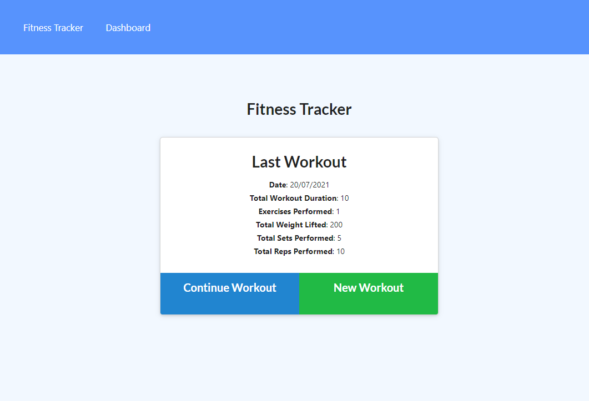
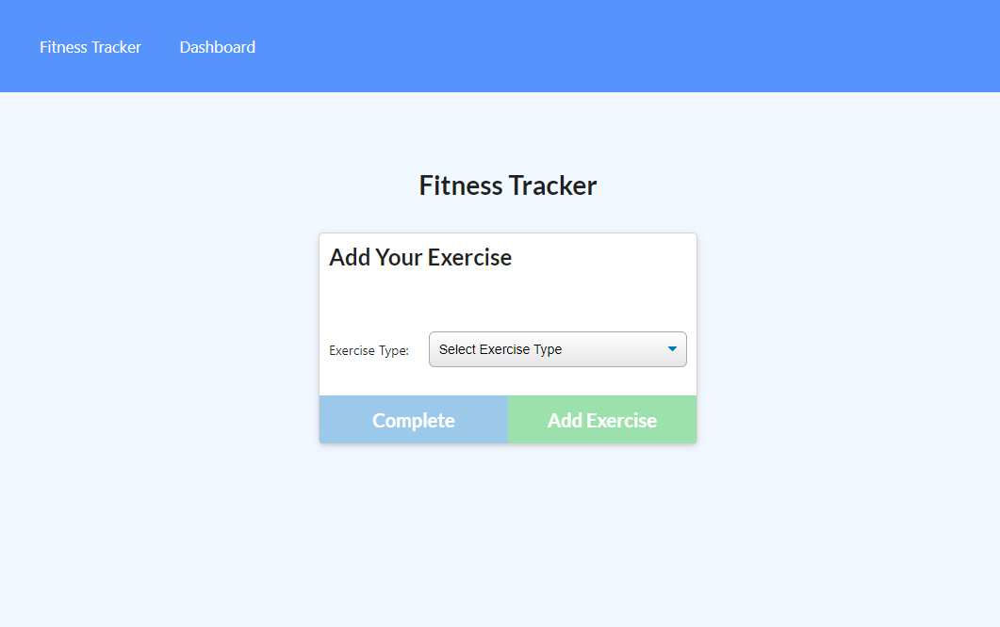
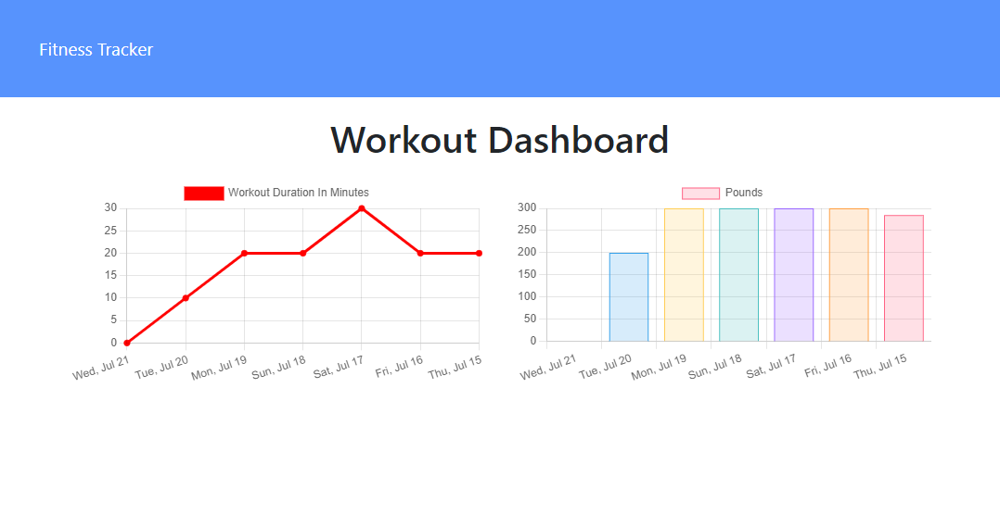

# Fitness Tracker 

## Description

A fitness tracker which allows a user to keep track of their workouts. Users can add new workouts, continue their workout and see charts showing their workouts.

## Table of Contents

[Description](#description)  
[Technologies Used](#technologies-used)  
[Getting Started](#getting-started)  
[Link to Deployed Application](#link-to-deployed-application)  
[Screenshots](#screenshots)
[License](#license)  
[Questions](#questions)

## Technologies Used

- HTML
- CSS
- JavaScript
- Node.js
- Express.js
- MongoDB
- Mongoose

## Getting Started

```
git clone git@github.com:chelseanicholls95/fitness-tracker.git
cd fitness-tracker
code .

npm install
npm run seed
npm run dev
```

## Link to Deployed Application

View the working application [here](https://mysterious-chamber-32416.herokuapp.com/?id=60f710fcd0a263001583d70c).

## Screenshots





## License

This app is licensed by MIT.

## Questions

- Visit my [Github](https://github.com/chelseanicholls95)
- Email me at: chelseanicholls1995@outlook.com
